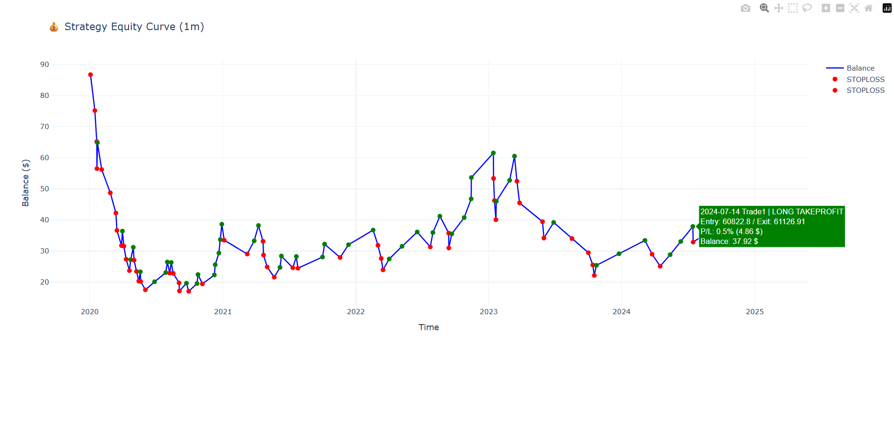

# Binance Vision Data Pipeline & Trading Bot (BTCUSDT Futures)

A Python project to **download, extract, and merge** Binance Vision monthly ZIP archives for Futures 1-minute OHLCV data.  
It also includes a **backtesting engine** and **live trading bots** (long-only and short-only) for Binance Futures (BTCUSDT).


---

## 🚀 Features

- **Data Pipeline**
  - Download monthly ZIP archives from Binance Vision
  - Extract CSV files from compressed archives
  - Merge into a single, time-sorted dataset (`*_merged.csv`)

- **Backtesting**
  - Rule-based strategy testing on 1-minute OHLCV data
  - Performance metrics: trade logs, win rate, final balance
  - Interactive equity curve visualization with Plotly

- **Trading Bot**
  - Connects to Binance Futures API
  - Two separate bots:
    - **Long Bot** → enters long after significant drop from recent high
    - **Short Bot** → enters short after significant pump from recent low
  - Both place TP/SL bracket orders automatically
  - Leverage & margin mode configuration

---

## 📦 Installation

```bash
git clone https://github.com/<your-username>/binance-trading-framework.git
cd binance-trading-framework
pip install -r requirements.txt
Dependencies include:
```
Dependencies include:

- pandas
- requests
- plotly
- python-binance
- python-dotenv

## ⚙️ Usage
**1. Download raw data**
```
python scripts/download_data.py
```

**2. Extract CSVs**
```
python scripts/extract_csv.py
```
**3. Merge into one dataset**
```
python scripts/merge_csv.py
```
Output: btc_usdt_1m_merged.csv

***4. Run backtest***
```
python backtesting/backtest1m.py
```
Generates:

- Trade history table

- Equity curve (interactive Plotly chart)

- Win rate & final balance summary

**5. Run trading bot (live trading)**

**Long bot**
```
python bots/trade_long_bot.py
```

- Enters long if price dropped ≥ threshold (default: 4% from recent high)

- Places TP (+0.8%) and SL (-0.3%) orders automatically


**Short bot**
```
python bots/trade_short_bot.py
```

- Enters short if price pumped ≥ threshold (default: 4% from recent low)

- Places TP (+0.8%) and SL (-0.3%) orders automatically

## 🔑 Environment Variables
Create a .env file in the project root:

```
BINANCE_API_KEY=your_api_key
BINANCE_SECRET_KEY=your_secret_key
```
⚠️ Never commit .env to GitHub. .gitignore already excludes it.

**📊 Example Output**

Backtest equity curve:




Bot console log:

```
[2025-08-13 21:51:35.634254] ✅ Bot running | drop: 0.27% | balance(USDT): 123.45
[2025-08-13 21:52:01.001235] [ENTRY] LONG BTCUSDT qty=0.01, price~62000.50, drop=4.05%
[2025-08-13 21:52:01.001987] [BRACKETS] TP=62496.00, SL=61814.00
```
## ⚠️ Disclaimer
This project is for educational and research purposes only.
Use at your own risk. The author is not responsible for financial losses.

## 📌 License
MIT License